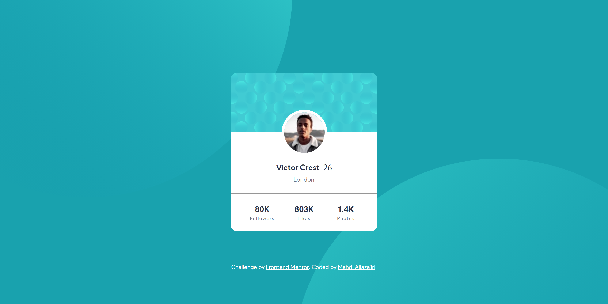

# Frontend Mentor - Profile Card Component Solution

This is a solution to the [Profile card component challenge on Frontend Mentor](https://www.frontendmentor.io/challenges/profile-card-component-cfArpWshJ).  
Frontend Mentor challenges help you improve your coding skills by building realistic projects. 

\*Me\* : I agree 👍

## Table of Contents

- [Overview](#overview)
  - [The Challenge](#the-challenge)
  - [Screenshot](#screenshot)
  - [Links](#links)
- [My Process](#my-process)
  - [Hardest Part](#hardest-part)
  - [What I Learned](#what-i-learned)
- [Tools](#tools)
- [Author](#author)

## Overview

### The Challenge

- Build out the project to the designs provided

### Screenshot

### Links

- Solution URL: <https://your-solution-url.com>
- Live Site URL: <https://your-live-site-url.com>

## My Process

### Hardest Part

Choosing meaningful class names. It's harder than you think!

### What I Learned

You can do math inside a `clamp()`. Wow.

## Tools

- [Dev Docs](https://devdocs.io) - The resource I was referring to throughout the process. It's an offline web app that has a huge collection of documentations.
- [Brackets](https://brackets.io) - My text editor. Not as powerful as VS Code, but still my favorite.
- Chrome - This web page was only tested on Chrome. 

## Author

- GitHub - [Mahdi Aljaza'iri](https://github.com/MahdiAljazairi)
- Frontend Mentor - [@MahdiAljazairi](https://www.frontendmentor.io/profile/MahdiAljazairi)
